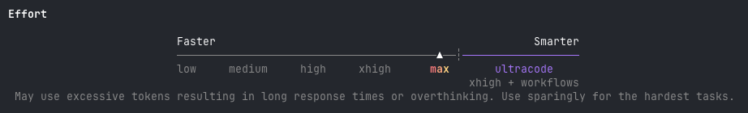
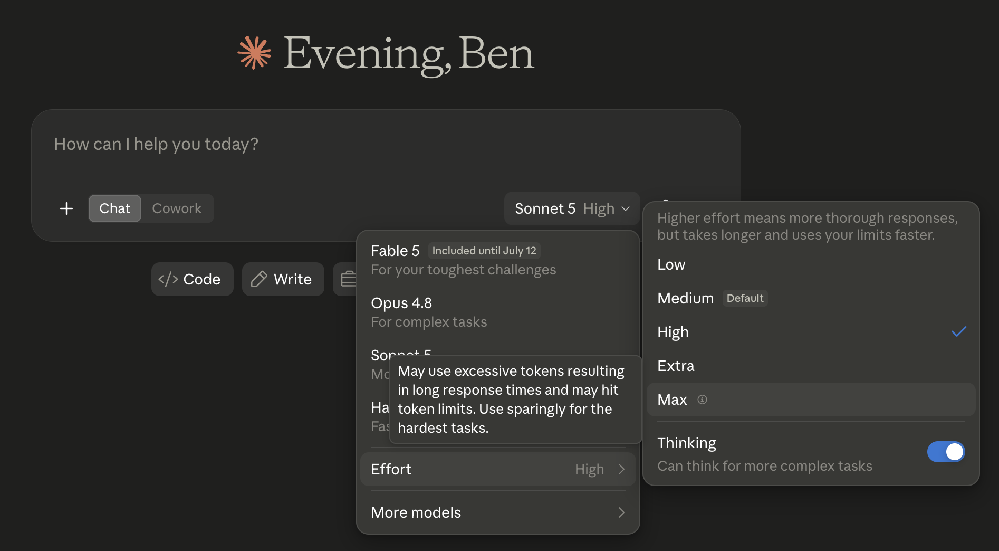
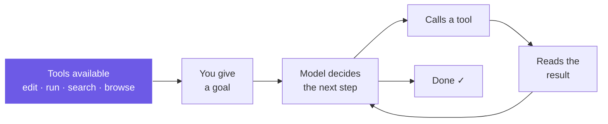
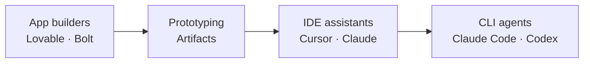
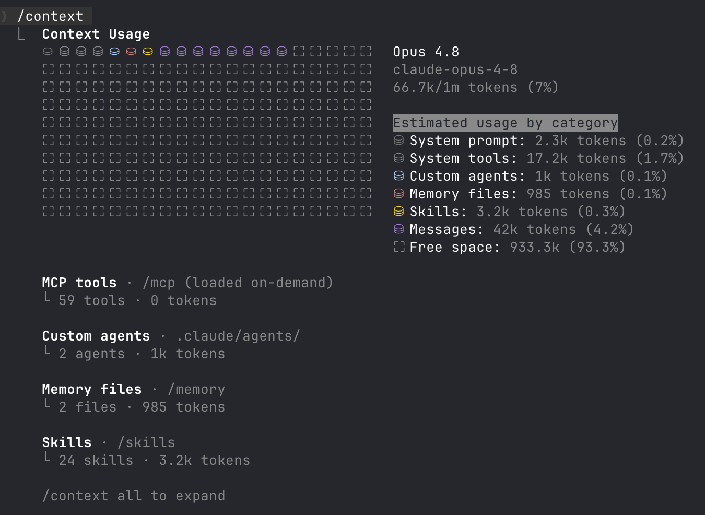
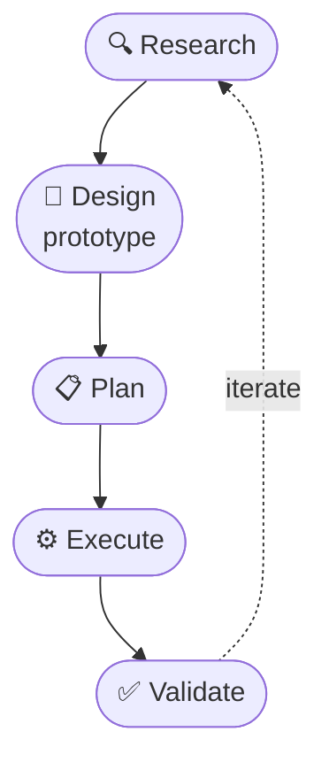
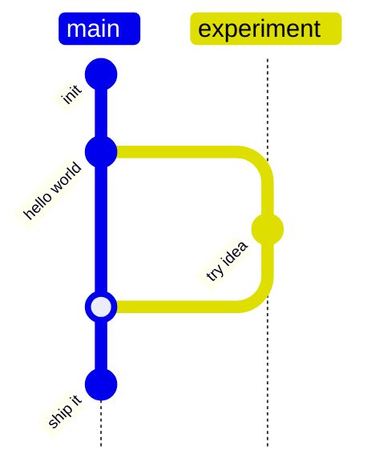

# Building with AI

### A field guide for non-engineers

<div class="pt-10 opacity-80">
For founders, operators &amp; builders who want to go beyond the prototype
</div>

<!--
Intros: state your name, 1 sentence about what you do and 1 sentence about why you came here or what you want to build
Who has used AI?
Who has used coding agents before?
-->

---
src: ../../about-me.md
hide: true
---

---
layout: default
---

# What we'll cover

<div class="gap-x-12 pt-4 text-lg">

<div v-click>

**1 · How LLMs actually work**

**2 · The tool landscape**

**3 · Myths**

**4 · Failure modes**

**5 · Engineering basics**

</div>

</div>

<!--
Roughly 5 minutes per section. Interrupt with questions — that's the point.
I need to speed through a lot of things so do stop me if you get lost.

<div class="opacity-70 text-base">1. Frame your mental model</div>
<div class="opacity-70 text-base">2. What to use, and when</div>
<div class="opacity-70 text-base">3. Where the hype misleads you</div>
<div class="opacity-70 text-base">4. Common traps to avoid</div>
<div class="opacity-70 text-base">5. Basic principles for solid foundations</div>
-->

---
layout: section
section: LLMs
---

# How LLMs work

<div class="opacity-70">A mental model, no prior knowledge required</div>

---
layout: default
---

# An extremely good autocomplete

<div class="opacity-70 -mt-2">

A **token** is just a chunk of text — a word, part of a word, or a symbol

</div>

<div class="flex flex-col items-center mt-10">

<div class="flex justify-center items-center flex-wrap gap-2 text-2xl font-medium">
  <span class="px-3 py-1 rounded-lg bg-rose-400/20 text-rose-200">Let</span>
  <span class="px-3 py-1 rounded-lg bg-amber-400/20 text-amber-200">'s</span>
  <span class="px-3 py-1 rounded-lg bg-emerald-400/20 text-emerald-200">build</span>
  <span class="px-3 py-1 rounded-lg bg-fuchsia-400/20 text-fuchsia-200">@</span>
  <span class="px-3 py-1 rounded-lg bg-sky-400/20 text-sky-200">3</span>
  <span class="px-3 py-1 rounded-lg bg-teal-400/20 text-teal-200">am</span>
  <span class="px-3 py-1 rounded-lg bg-orange-400/20 text-orange-200">!</span>
  <span class="px-4 py-1 rounded-lg border-2 border-dashed border-indigo-300/80 text-indigo-200">?</span>
</div>

<div v-click class="mt-8 text-xl flex flex-wrap justify-center items-baseline gap-x-5 gap-y-1">
  <span><span class="text-indigo-300 font-semibold">🚀</span> &nbsp;58%</span>
  <span class="opacity-70">😴 &nbsp;24%</span>
  <span class="opacity-60">coffee &nbsp;12%</span>
  <span class="opacity-50">again &nbsp;3%</span>
  <span class="opacity-40">…</span>
</div>

</div>

<div class="mt-12 p-4 border-l-4 border-indigo-400 bg-indigo-400/10 rounded">

**LLMs** simply predict what comes <span class="text-indigo-300">**next**</span>

</div>

<!--
Most of you will probably know what tokens are
-->

---
layout: two-cols-header
---

# From smart autocomplete to PhD Mathematics

::left::

<div class="pr-6">

Pre-training teaches patterns. **Post-training teaches it to work through problems.**

- Shown thousands of **human worked solutions** to hard tasks
- Rewarded (RL) when its **step-by-step** reasoning lands on the right answer
- So it learns to **think first, answer second**

<div class="mt-5 opacity-80">

This is why modern models pause to <span class="text-indigo-300">"reason"</span> before replying, and why it can do complex work.

</div>

</div>

::right::

<div class="pl-6">

<div class="text-sm opacity-90 mb-2 leading-snug">John buys 6 bananas, 4 oranges &amp; 1 watermelon. Bananas are 50p, oranges cost double, and a watermelon is triple a banana and an orange combined. <br/> £20 should cover it but what change is he owed?</div>

<div class="border-l-4 border-indigo-400/70 pl-4 py-2 italic text-[0.8rem] leading-relaxed bg-indigo-400/5 rounded-r space-y-1">

<v-clicks>

<div>Bananas: 6 × 50p = £3.00.</div>
<div>Oranges are double a banana → £1 each. 4 × £1 = £4.00.</div>
<div>"Triple a banana + an orange combined" → 50p + £1 = £1.50.</div>
<div>Watermelon = 3 × £1.50 = £4.50.</div>
<div>Total spent = 3 + 4 + 4.50 = £11.50.</div>
<div>Change = £20 − £11.50 = £8.50.</div>
<div class="not-italic font-semibold text-indigo-200">John is owed £8.50 in change.</div>

</v-clicks>

</div>

<div class="text-xs opacity-50 mt-2">↑ the model "thinking out loud" before it answers</div>

</div>

::bottom::

<div v-click class="text-center opacity-80">

You usually see a short answer. The <span class="text-indigo-300">hidden reasoning</span> is where the real work happens.

</div>

<!--
post-training is what turns a pattern-matcher into
something that solves problems.

Two things to point out:
(1) it has to INTERPRET an ambiguous prompt — "triple ... combined"
(2) then break down the problem so it can more accurately predict each part
-->

---
layout: default
---

# Effort and reasoning dial

<div class="opacity-80 -mt-1 mb-2">More effort = more thorough, but slower and more tokens</div>
<div class="opacity-80 -mt-1 mb-2">You choose how hard it thinks.</div>

<div class="flex flex-col items-center justify-center min-h-[300px]">

<v-switch tag="div" transition="swipe" class="w-full flex justify-center relative overflow-hidden">

<template #0>
<div class="flex flex-col items-center">

<div class="text-xs opacity-60 mt-2 text-center">In the terminal — Claude Code effort levels</div>
</div>
</template>

<template #1>
<div class="flex flex-col items-center">

<div class="text-xs opacity-60 mt-2 text-center">In the Claude app — effort per message</div>
</div>
</template>

</v-switch>

</div>

<!--
"reasoning" isn't free — it costs time and tokens.

Practical advice: I default to a high setting; crank it up to max for genuinely hard problems, drop it for simple/bulk work.
-->

---
layout: default
---

# What makes it an "agent"

A plain chatbot only talks. An **agent** can act — in a loop:



<v-clicks>

- **A list of tools** with instruction manuals is called a __*harness*__
  - search the web
  - search files on my laptop
  - write a PDF
  - ...

</v-clicks>

<!--
This is THE concept behind Cursor, Claude Code, etc. The loop is the product.
-->

---
layout: section
section: Tooling
---

# Tooling landscape

<div class="opacity-70">What to reach for, and when</div>

---
layout: default
---

# Four families of tools

<div class="grid grid-cols-2 gap-6 pt-2">

<div v-click class="p-4 rounded-lg bg-gray-400/10 border border-gray-500/30">

### 🏗️ End-to-end app builders
**Lovable · Bolt · v0 · Replit**

Describe an app in plain English → get a working, hosted web app. No setup.

</div>

<div v-click class="p-4 rounded-lg bg-gray-400/10 border border-gray-500/30">

### 🎨 Prototyping & design
**Claude Artifacts · Magic Patterns · Figma AI**

Fast, throwaway UI and concept exploration. Great for "what could this look like?"

</div>

<div v-click class="p-4 rounded-lg bg-gray-400/10 border border-gray-500/30">

### 🤝 AI coding assistants
**Cursor · Claude · Codex · Windsurf**

Sit inside a real codebase. For when you (or an engineer) own the code.

</div>

<div v-click class="p-4 rounded-lg bg-gray-400/10 border border-gray-500/30">

### ⌨️ CLI / terminal agents
**Claude Code · Codex CLI · Gemini CLI**

Most powerful & flexible. Live in the terminal, closest to the "real" workflow.

</div>

</div>

<!--
Frame these as a spectrum from "hand-holding, low ceiling" to "raw power, needs
skill." Builders get you to demo fast; CLI agents scale but assume more from you.
-->

---
layout: default
---

# Trade-off: speed now vs. ceiling later

<div class="h-8"></div>



<div class="grid grid-cols-2 gap-8 pt-6 text-lg">

<div v-click>

**← Easier to start**
- Zero setup
- Instant results
- Hits a wall as complexity grows

</div>

<div v-click>

**Higher ceiling →**
- Owns real, portable code
- Scales to a serious product
- Assumes more judgement from you

</div>

</div>

<div v-click class="mt-12 text-center opacity-80">

The right tool depends on <span class="text-indigo-300">how far you intend to take it.</span>

</div>

<!--
The key insight for founders: a prototype in Lovable is perfect for validating
an idea. It's the WRONG place to build the thing you'll raise money on. Know
which phase you're in.
You can use all of these in sequence.
-->

---
layout: section
section: Myths
---

# Myths

<div class="opacity-70">Common AI misconceptions</div>

---
layout: default
---

# Myth #1 — "AI outsourcing"

<div class="h-2"></div>

<div class="flex flex-col items-center mt-4">

<iframe
  width="203" height="360"
  src="https://www.youtube.com/embed/4F_XvwNsjaM"
  title="Jensen Huang on why most people use AI wrong"
  frameborder="0"
  allow="accelerometer; autoplay; clipboard-write; encrypted-media; gyroscope; picture-in-picture; web-share"
  referrerpolicy="strict-origin-when-cross-origin"
  allowfullscreen
  class="rounded-lg border border-gray-500/30"
></iframe>

<div class="text-xs opacity-60 mt-2">Jensen Huang: why most people use AI wrong</div>

</div>

<!--
if you're using AI correctly, it will make you think harder not less.
-->

---
layout: default
---

# Myth #2 — "I won't need to hire engineers"

<v-clicks>

- AI dramatically **speeds up** writing code. It does **not** remove the need to *decide what to build and why*

- It won't be able to judge what is important: trade-offs, speed, security, "does this actually work?"

- The job is shifting from **typing code** → **directing decisions, reviewing, and verifying**

- Teams get *smaller and more leveraged*, not *deleted*

</v-clicks>

<div v-click class="mt-8 p-4 border-l-4 border-indigo-400 bg-indigo-400/10 rounded">

**Do more with less**. Engineers are force multipliers that own real responsibility.

</div>

<!--
For founders: don't fire your engineers. Do expect each one to do more. AI raises your floor
Don't worry, you can probably get away without engineers for simple projects and prototypes
Solution: become an engineer yourself guided by AI!
-->

---
layout: default
---

# Myth #3 — "AI coding black box"

<v-clicks>

- You don't need to *write* it but **you do need to understand what it did**
- Why? So you can **recognise when something's wrong** and jump in
  - Can you tell a good answer from a confident wrong one?
  - Can you fully trust that the AI hasn't made a mistake or forgotten something?
- The gap shows up at the worst time: a security hole, a data loss, a bill that 10×'d overnight
- A little literacy (what a database is, what "deploy" means) pays for itself fast

</v-clicks>

<div v-click class="mt-8 p-4 border-l-4 border-indigo-400 bg-indigo-400/10 rounded">

You can't <span class="italic">steer</span> what you don't <span class="italic">understand.</span>

</div>

<!--
You don't even necessarily need to look at the code.
Practical tips: you can use AI adverserially to grade its own homework and also to help you understand
- [Grill-me](https://github.com/mattpocock/skills/blob/main/skills/productivity/grilling/SKILL.md)
- [Explain-diff](https://gist.github.com/geoffreylitt/a29df1b5f9865506e8952488eac3d524)
-->

---
layout: section
section: Failure modes
---

# AI failure modes

<div class="opacity-70">Know the traps before they bite</div>

---
layout: default
---

# Failure #1: Doing bad work

<div class="opacity-80 -mt-2 mb-4">AI is a smart auto-complete — it loves to <b>add</b> and has a hard time stopping</div>

<div class="fm-head sym">⚠️ Symptoms</div>

<v-clicks>

- Doesn't do things **the way you expect** because it's missing context or direction

- Goes off on a **tangent** polluting context as it goes

- **Over-thinks & over-engineers** solutions it doesn't need

- **Invents work** from a small misunderstanding, e.g. fixing a niche edge case that never happens

- Assumes you're a **giant corporate** with heavy process

- Writes **long multi-step plans** with redundant work instead of jumping to the solution

</v-clicks>

<!--
The "runaway junior" failure — it doesn't know when to STOP. It'll gold-plate,
handle impossible edge cases, and add process nobody asked for. Root cause: it's
completing a pattern, and "more" often looks like a better completion.
-->

---
layout: default
---

# Antidote #1: memory, framing & verification

<div class="opacity-80 -mt-2 mb-4">Memory and Skills are just <b>plain-text files</b> you control</div>

<div class="grid grid-cols-[minmax(0,1fr)_minmax(0,1fr)] gap-8 items-start">

<div class="min-w-0">

```markdown
---
name: run-plan
description: Use when asked to run a plan
---

Don't make assumptions — verify the code.
The plan may be out of date, or the code
may have changed since it was written.
...
```

<div class="text-xs opacity-60 mt-1 text-center">a skill = a Markdown file the agent reads</div>

</div>

<div>

<div class="fm-head rem">✅ Take control</div>

<v-clicks>

- Want things done a **specific way**? Write a **skill**

- **Steer its memory** by writing `CLAUDE.md` or `AGENTS.md` files

- Manipulate **built-in memory**. Ask it to **remember** or **forget** what it needs to know.

- **Review** your skills & `CLAUDE.md` regularly. Especially when new models ship

</v-clicks>

</div>

</div>

<!--
Skills = reusable instructions the agent loads when relevant ("how we write commits").
Memory / CLAUDE.md = persistent facts about you and the project.
Both are plain text you can read, edit, and commit to Git — demystify the black box,
you curate what it knows and how it behaves. Skills can also encode verification
steps like "always run the tests before you call it done".
-->

---
layout: default
---

# Failure #2: Context Rot

<div class="grid grid-cols-[1fr_minmax(0,380px)] gap-10 items-start mt-4">

<div class="flex flex-col">
  
  <div class="text-xs opacity-60 mt-2 text-center">Answer quality drops as the context window fills up</div>
</div>

<div class="text-sm">

**Symptoms:**

<v-clicks>

- forget earlier decisions
- cling rigidly to a bad early choice
- gets confused and goes in circles

</v-clicks>

**Causes:**
<v-clicks>

- long sessions
- large file attachements
- bloated AGENTS/CLAUDE.md files
- too many skills

</v-clicks>


</div>

</div>

<!--
This is the number 1 takeaway. if you were to retain 1 thing, this is it
Context is the agent's memory
Claude models give you 1M tokens but in practice the agent stops working well after ~500k tokens
Tips:
- compaction
- planning & discovery
- go back in history
-->

---
layout: two-cols-header
---

# Antidote #2: split the context

<div class="opacity-70 -mt-2 mb-2">Short, focused passes. Not one marathon session</div>

::left::



::right::

<div class="pl-6">

<v-clicks>

- **Plan** and **execute** in separate sessions

- Be **ruthless**. Kill context, start fresh

- **Compact** at natural break points

- **Rewind & replay** from a known-good point

- Generation is cheap. Don't be afraid to **throw work away** and retry

</v-clicks>

</div>

<style>
.mermaid { display: flex; justify-content: center; }
</style>

<!--
Tie back to context rot: the loop IS the fix. Don't do research, planning and
execution in one giant thread. Each phase gets a focused context.
- Research: explore, read, gather — read-only, throwaway.
- Design/prototype: cheap, disposable mock to pressure-test the idea.
- Plan: write the plan down so it survives a fresh session.
- Execute: implement against the plan.
- Validate: test, review, verify it actually works — then loop.

Skill:
- handover skill
-->

---
layout: two-cols-header
---

# Failure #3: Blind trust

::left::

<div class="fm-head sym">⚠️ Symptoms</div>

<v-clicks>

- Models are **eager to please** (post-trained as helpful assistants)
- A smart autocomplete: it **mirrors your prompt** and context back at you
- *"Is this a good idea?"* → *"Great idea!"* — even when it isn't
- **Agrees with a wrong correction**, or invents agreement to keep you happy
- Praise ≠ validation

</v-clicks>

::right::

<div class="fm-head rem">✅ Remediations</div>

<v-clicks>

- Ask for the **case against**: "What's wrong with this?"
- Demand **trade-offs** and failure modes, not a verdict
- Make it **argue both sides** / play the critic
- Get real signal from **users & data**, not the model's approval

</v-clicks>

::bottom::

<div v-click class="mb-4 p-4 border-l-4 border-indigo-400 bg-indigo-400/10 rounded text-sm">
Feed LLMs garbage in, get garbage out
</div>


<!--
Related to our earlier myth
Adversarial prompting gets far more signal.
/batch
/code-review
-->

---
layout: section
section: Engineering basics
---

# 5 · Engineering basics

<div class="opacity-70">Get started on the right foot</div>

---
layout: two-cols-header
---

# What is "code"? And what is Git?

::left::

<div class="pr-6">

**Code**

Plain text files with instructions a computer follows.

```go
package main

import "fmt"

func main() {
	fmt.Println("Hello world!")
}
```

</div>

::right::

<div class="pl-6 border-l border-gray-500/40">

**Git & GitHub**

<div class="text-base">

- **Git** -> a time machine for your files. Every save ("commit") is a restore point.
- **GitHub** -> hosted Git (stores it in the cloud)

</div>

</div>

::bottom::

<div v-click class="mb-6 p-4 border-l-4 border-indigo-400 bg-indigo-400/10 rounded">

Without Git, an AI agent can **wreck your project** with **no undo**

</div>

<!--
If they take ONE practical thing away: use Git from commit #1. It's the seatbelt.
AND it's how you'll hand the project to a real engineer later without pain.
-->

---
layout: two-cols-header
---

# Git repositories

<div class="opacity-70 -mt-2 mb-4">A "repo" is just a project folder that Git watches</div>

::left::

<div class="pr-6">

**A tiny TypeScript project**

```bash
hello-world/ <--- this is the name of your repo and also just a folder
├── src/
│   └── index.ts
├── README.md
├── CLAUDE.md
├── package.json
└── tsconfig.json
```

<div class="text-sm opacity-60 mt-1">Plain files in folders — nothing magic</div>

</div>

::right::

<div class="pl-6 border-l border-gray-500/40">

**A commit history**



<div class="text-sm opacity-60 mt-1">Each dot is a saved snapshot you can return to</div>

</div>

<!--
Left: demystify — a repo is just a folder. CLAUDE.md/README.md are plain text.
Right: walk the graph. Commit = a labelled restore point. The line is main.
The branch is a safe sandbox to try something; merge folds it back in. If the
experiment was bad, you just delete the branch — main never broke.
-->

---
layout: two-cols-header
---

# Picking technologies

::left::

<div class="pr-6">

**Optimise for:**

<v-clicks>

- **Popularity** — AI knows it well, answers exist
- **Fit** — right tool for *your* problem
- **Longevity** — will it still exist in 2 years?
- **Hireability** — can you find humans for it?

</v-clicks>

</div>

::right::

<div class="pl-6 border-l border-gray-500/40">

**Avoid:**

<v-clicks>

- The newest, shiniest AI tool or stack you saw advertised on Instagram
- Anything you chose *only* because the AI suggested it
- A zoo of technologies. You only need 1 hosting provider

</v-clicks>

</div>

---
layout: default
---

# Personal recommendations

<div class="opacity-70 -mt-2 mb-4">What I reach for today — opinionated, not gospel</div>

<div class="grid grid-cols-2 gap-5">

<div v-click class="p-4 rounded-lg bg-gray-400/10 border border-gray-500/30">

### 💻 Code & framework

- **Web** — Next.js (React + TypeScript)
- **Mobile** — Flutter (Dart)

</div>

<div v-click class="p-4 rounded-lg bg-gray-400/10 border border-gray-500/30">

### ☁️ Hosting

- **Cloudflare** — does everything, and it's cheap
- **Vercel**
- **Railway**

</div>

<div v-click class="p-4 rounded-lg bg-gray-400/10 border border-gray-500/30">

### 🗄️ Databases

- **Neon** — cheap
- **Supabase** — more features

</div>

<div v-click class="p-4 rounded-lg bg-gray-400/10 border border-gray-500/30">

### 🤖 Agents

- **Claude Agents SDK**
- **Temporal**

</div>

</div>

<!--
Stress that these are defaults, not rules — the "boring & popular" principle
from the last slide is what matters. Boring picks: Next.js/React, managed
hosting, managed Postgres (Neon/Supabase). Hono = lightweight API layer.
Flutter = one codebase for iOS + Android. Agents: Claude Agent SDK to build
your own; Temporal when the work is long-running and must not silently fail.
-->

---
layout: two-cols-header
---

# Infrastructure is code

<div class="opacity-70 -mt-2 mb-4">Your servers, databases &amp; domains — described in files, not clicks</div>

::left::

<div class="pr-6">

**A server, described in a file**

```hcl
resource "cloudflare_record" "app" {
  zone_id = var.zone_id
  name    = "app"
  type    = "CNAME"
  content = "my-app.pages.dev"
  proxied = true
}
```

<div class="text-sm opacity-60 mt-1">Run it → the infra exists. Edit it → the infra updates.</div>

</div>

::right::

<div class="pl-6 border-l border-gray-500/40">

<v-clicks>

- 🚫 **Don't click around in UIs** — clicks aren't repeatable, and no one remembers what they did
- 🤖 **Agents can do the work** — it's just code, so they can write and change it for you
- 📜 **Tracked in Git** — every change is auditable & reversible

</v-clicks>

</div>

<!--
Tie back to Git: infra-as-code gets the same superpowers as your app code —
review, history, undo. Tools: Terraform / OpenTofu, Pulumi, or platform-native
configs (wrangler.toml for Cloudflare, railway.json). The point for this
audience: dashboards feel easy but rot fast; a file an agent can edit scales.
-->

---
layout: center
class: text-center
---

# Thank you 🙏

### Questions?

<!--
Open the floor. Then, for stayers: transition into setting up their environment
and picking a project to build together.
-->
